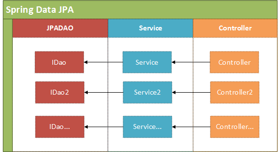
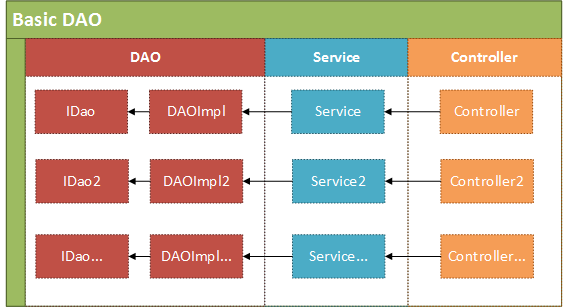

# EasyCommonDAO 使用手册

EasyCommonDAO 为 Java ORM 主流持久层技术提供通用的 `DAO（Data Access Object）` 支持。旨在于消除 DAO 层接口定义和实现。

## 版本 

- Least version:  `EasyCommonDAO-1.4.0-RELEASE`

- Test enviroment: 

 ```
 Hibernate 5.2.4(JPA 2.1)
 Hibernate 4.3.11(JPA 2.1)
 Hibernate 3.6.10(JPA 2.0)
 EclipseLink 2.6.4(JPA 2.0+)
 Spring 4.3.3
 ```

## 特点

1. 提供基于 **Hibernate Native APIs** 和 **Java Persistence API (JPA)** (`Hiberante`， `EclipseLink`) 的通用 DAO 实现

2. 消灭 DAO 层接口定义和实现

3. 两项实现选择：**纯 ORM 实现**，**Spring 无缝集成实现**

5. 简单易用，学习成本低，Hibernate 和 JPA 使用统一接口规范

4. 提供分页对象（`PageBean`），条件对象（`EasyCriteria`）综合查询

5. 提供缓存查询；缓存管理；批量数据处理；级联删除支持...


## EasyCommonDAO Architecture 架构


## Technical comparison/技术比较

相较于 `普通的 DAO实现` 和 `Spring Data JPA` ，`EasyCommonDAO` 既无需定义 DAO 接口，也无需学习方法命名解析规范。降低学习成本，并真正的消除 DAO 层实现。


- **EasyCommonDAO**

 

- **Spring Data JPA**

 

- **Basic DAO**

 


## Maven

```XML
<dependency>
    <groupId>cn.easyproject</groupId>
    <artifactId>${EasyCommonDAO.artifactId}</artifactId>
    <version>1.4.0-RELEASE</version>
</dependency> 
```

**选择一个 EasyCommonDAO.artifactId**

- Hibernate Native API

 ```
 `easycommondao-hibernate5`
 
 `easycommondao-hibernate4`
 
 `easycommondao-hibernate3`
 ```

- JPA

 ```
 `easycommondao-jpa-hibernate5`
 
 `easycommondao-jpa-hibernate4`
 
 `easycommondao-jpa-hibernate3`
 
 `easycommondao-jpa-eclipselink`
 ```

## 纯 ORM 使用

1. 配置框架

 - 配置 Hibernate3/4/5: `hibernate.cfg.xml`
 
 - 配置 JPA(`Hibernate3/4/5`, `EclipseLink`): `persistence.xml`，指定 `name="EasyCommonDAO"`
 
    ```XML
    <persistence-unit name="EasyCommonDAO" transaction-type="RESOURCE_LOCAL">
    ```

2. 编写 Service 业务层，创建 CommonDAO，调用 CommonDAO API

 ```JAVA
 public class UserServiceImpl implements UserService {
 
      // EasyCommonDAO instance
      public CommonDAO dao=new CommonDAOImpl();
      
      public void get(int userId){
          // Invoke ComonDAO API
          return dao.find(User.class, userId);
      }
 
      // ...
 }
 ```


## Spring 无缝集成 ORM 使用

1. 配置 Spring DAO， 一般包括: 
 
 - `DataSource`
 
 - `EntityManagerFactory`/`SessionFactory`
 
 - `TransactionManager` 

3. 配置 Spring 扫描 `cn.easyproject` 包

 ```XML
 <context:component-scan base-package="cn.easyproject"></context:component-scan>
 ```

2. Service 层注入 CommonDAO， `@Resource(name="commonDAO")`，调用 CommonDAO API

 ```JAVA
 public class UserServiceImpl implements UserService {
 
      // Inject EasyCommonDAO instance
      @Resource(name="commonDAO")
      public CommonDAO dao;
      
      public void get(int userId){
          // Invoke ComonDAO API
          return dao.find(User.class, userId);
      }
 
      // ...
 }
 ```

## PageBean 分页
 
**EclipseLink** 必须指定 select 语句。

- Example
 
 ```JAVA
 PageBean pb = new PageBean();

 // FROM Clause; optional
 // **If use EclipseLink is required!**
 pb.setSelect(" select new com.company.ssh.entity.Account(ac.accountid, ac.qxname) ");
 // FROM Clause Entity Name; rquired
 pb.setEntityName("Account ac"); 
 // Page Number; optional; default is 1
 pb.setPageNo(1); 
 // Rows per page; optional; default is 10
 pb.setRowsPerPage(4);
 // WHERE Clause; optional; default is ''
 pb.setCondition(" and ac.accountid>2");
 // Append where clause condition; optional; default is ''
 // pb.addCondition(" and name='A'");
 // SortName; optional; default is ''
 pb.setSort("ac.accountid");
 // SortOrder; optional; default is 'asc'
 pb.setSortOrder("desc");
 // Other sorting methods; optional; default is ''
 pb.setLastSort(",time desc");

 // Execute pagination quries
 commonDAO.findByPage(pb); 
 
 // Pagination data
 System.out.println(pb.getData());
 System.out.println(pb.getPageNo());
 System.out.println(pb.getRowsPerPage());
 System.out.println(pb.getRowsCount());
 System.out.println(pb.getPageTotal());
 ```

- Example2

 ```JAVA
 // Immediate use this query
 // data sql
 pb.setQuery("select ac from Account ac where ac.accountid>=10 and ac.accountid<1000");
// total sql
 pb.setCountSQL("select count(1) from Account ac where ac.accountid>=10 and ac.accountid<1000"); 
  // Page Number; optional; default is 1
 pb.setPageNo(1); 
 // Rows per page; optional; default is 10
 pb.setRowsPerPage(4);

 // Execute pagination quries
 commonDAO.findByPage(pb); 

 // Pagination data
 System.out.println(pb.getData());
 System.out.println(pb.getPageNo());
 System.out.println(pb.getRowsPerPage());
 System.out.println(pb.getRowsCount());
 System.out.println(pb.getPageTotal());
 ```


## EasyCriteria 条件查询

1. 创建 EasyCriteria 类, 必须 `extends EasyCriteria implements Serializable`

2. 编写条件方法 `getCondition()`

 ```JAVA
 public class SysUserCriteria extends EasyCriteria implements java.io.Serializable {
 	// 1. Criteria field
 	private String name;
 	private String realName;
 	private Integer status; // 0 is ON; 1 is OFF; 2 is REMOVED
 
 	// 2. Constructor
 	public SysUserCriteria() {
 	}
 
 	public SysUserCriteria(String name, String realName, Integer status) {
 		super();
 		this.name = name;
 		this.realName = realName;
 		this.status = status;
 	}
 
 	// 3. Condition genertator abstract method implements
 	public String getCondition() {
 		values.clear(); // **Must clear old values**

 		StringBuffer condition = new StringBuffer();
 		if (StringUtils.isNotNullAndEmpty(this.getName())) {
 			condition.append(" and name like ?");
 			values.add("%" + this.getName() + "%");
 		}
 		if (StringUtils.isNotNullAndEmpty(this.getRealName())) {
 			condition.append(" and realName like ?");
 			values.add("%" + this.getRealName() + "%");
 		}
 		if (StringUtils.isNotNullAndEmpty(this.getStatus())) {
 			condition.append(" and status=?");
 			values.add(this.getStatus());
 		}
 		return condition.toString();
 	}
 
 	// 4. Setters&amp;Getters...
 
 }
 ```

3. 通过 EasyCriteria 进行分页查询

 ```JAVA
 PageBean pageBean = new PageBean();
 pageBean.setEntityName("SysUser users");
 pageBean.setSelect("select users");

 // EasyCriteria
 SysUserCriteria usersCriteria =new SysUserCriteria();
 usersCriteria.setName("A");
 usersCriteria.setStatus(0);
 
 // Find by EasyCriteria
 commonDAO.findByPage(pageBean, usersCriteria);
 ```
 


## CommonDAO API 

```JAVA
/**
 * 使用JDBC执行原生的批量SQL，单参数语句值列表
 * @param sql SQL语句
 * @param values 单参数语句值列表
 */
public void batchUpdateSQL(String sql, Object[] values);
/**
 * 使用JDBC执行原生的批量SQL，多参数语句值列表
 * @param sql SQL语句
 * @param values 多参数语句值列表
 */
public void batchUpdateSQL(String sql, Object[][] values);

/**
 * 删除持久对象
 * 
 * @param cls 类型
 * @param id OID
 */
public void remove(Class cls, Serializable id);

/**
 * 删除持久对象
 * 
 * @param o 实体对象
 */
public void remove(Object o);
/**
 * 使用 Query 语句批量删除，不支持级联
 * @param cls 类型ls 类型
 * @param fieldName 删除条件字段
 * @param values 语句参数值列表List 要删除的字段列表，使用,分隔
 * @return affected rows count
 */
public Integer deleteByValues(Class cls, String fieldName, Object[] values);
/**
 * 使用 Query 语句批量删除，支持级联
 * @param cls 类型
 * @param fieldName 删除条件字段
 * @param values 集合值列表
 */
public void deleteCascadeByValues(Class cls, String fieldName, Object[] values);
 

/**
 * 清除二级缓存中所有的c对象
 * @param cls 类型
 */
public void evict(Class cls);
/**
 * 清除二级缓存中OID为id的c对象
 * @param cls 类型
 * @param id OID
 */
public void evict(Class cls,Serializable id);
/**
 * 清除二级缓存中所有对象
 */
public void evictAll();
/**
 * 清除二级缓存中指定类的集合属性
 * @param collectionRegion 查询缓存区域
 */
public void evictCollectionRegion(String collectionRegion);
/**
 * 清除二级缓存中指定id类的集合属性
 * @param collectionRegion 查询缓存区域
 * @param id OID
 */
public void evictCollectionRegion(String collectionRegion,Serializable id);
/**
 * 清除默认区域的查询缓存策略，如果默认为空，则清除所有标准区域查询缓存策略
 */
public void evictQueries();
/**
 * 清除指定区域策略的查询缓存
 * @param queryCacheRegion 指定查询缓存区域
 */
public void evictQueries(String queryCacheRegion);


/**
 * 通过Id查询
 * @param cls 类型
 * @param id OID
 * @return Object
 */
public <T> T find(Class cls, Serializable id);

/**
 * 按条件根据jpql查询
 * @param jpql jpql语句 jpql
 * @param easyCriteria EasyCriteria条件对象
 * @return List
 */
public List find(String jpql,EasyCriteria easyCriteria);
/**
 * 根据jpql查询
 * @param jpql jpql语句 jpql
 * @param values 语句参数值列表 参数列表
 * @return List
 */
public List find(String jpql, Object... values);
/**
 * 查询所有
 * @param cls 类型ls
 * @return List
 */
public List findAll(Class cls);

/**
 * 带查询缓存查询，
 * 查询缓存，使用DEFAULT_QUERY_CACHE_REGION指定区域的缓存，如DEFAULT_QUERY_CACHE_REGION==null或=="",则使用默认标准区域缓存策略
 * @param jpql jpql语句
 * @param easyCriteria EasyCriteria条件对象 
 * @return List
 */
public List findByCache(String jpql, EasyCriteria easyCriteria);
/**
 * 带查询缓存查询，
 * 查询缓存，使用DEFAULT_QUERY_CACHE_REGION指定区域的缓存，如DEFAULT_QUERY_CACHE_REGION==null或=="",则使用默认标准区域缓存策略
 * @param jpql jpql语句
 * @param values 语句参数值列表
 * @return List
 */
public List findByCache(String jpql, Object... values);
/**
 * 查询缓存,需要指定具体的缓存策略区域
 * @param jpql jpql语句
 * @param queryCacheRegion 指定查询缓存区域
 * @param easyCriteria EasyCriteria条件对象 
 * @return List
 */
public List findByCache(String jpql, String queryCacheRegion, EasyCriteria easyCriteria);
/**
 * 查询缓存,需要指定具体的缓存策略区域
 * @param jpql jpql语句
 * @param queryCacheRegion 指定查询缓存区域
 * @param values 语句参数值列表
 * @return List
 */
public List findByCache(String jpql, String queryCacheRegion, Object... values);

/**
 * 分页查询
 * @param pageBean pageBean
 */
public void findByPage(PageBean pageBean);
/**
 * 分页查询
 * @param pageBean pageBean
 * @param easyCriteria 按条件分页查询方法
 */
public void findByPage(PageBean pageBean,EasyCriteria easyCriteria);

/**
 * 分页查询
 * @param pageBean pageBean
 * @param values 语句参数值列表
 */
public void findByPage(PageBean pageBean,List values);  
/**
 * 简单查询，按照字段查询
 * @param cls 类型ls
 * @param propertyName 属性名
 * @param value 属性值
 * @return List
 */
public List findByProperty(Class cls, String propertyName, Object value);  
/**
 * 按照字段查询，不区分大小写
 * @param cls 类型ls
 * @param propertyName 属性名
 * @param value 属性值
 * @return List
 */
public List findByPropertyIgnoreCase(Class cls, String propertyName, String value);
/**
 * 执行Native SQL，返回封装的 Map 对象集合
 * @param sql SQL语句
 * @param resultClass 类型 封装的类型
 * @param easyCriteria EasyCriteria条件对象 
 * @return 查询的结果封装为transformers指定的类型
 */


public List findBySQL(String sql, Class resultClass, EasyCriteria easyCriteria);
/**
 * 执行Native SQL，返回封装的对象集合
 * @param sql SQL语句
 * @param resultClass 类型 封装的类型
 * @param values 语句参数值列表
 * @return 查询的结果封装为c指定的实体
 */
public List findBySQL(String sql, Class resultClass, Object... values);
/**
 * 执行Native SQL，返回封装的对象集合
 * @param sql SQL语句
 * @param easyCriteria EasyCriteria条件对象 
 * @return 查询的结果，多列时转换为Object[]
 */
public List findBySQL(String sql,EasyCriteria easyCriteria);
/**
 * 执行Native SQL，返回封装的对象集合
 * @param sql SQL语句
 * @param values 语句参数值列表
 * @return 查询的结果，多列时转换为Object[]
 */
public List findBySQL(String sql,Object... values);


/**
 * 通过jpql语句查询总条数
 * @param jpql jpql语句
 * @param easyCriteria EasyCriteria条件对象 
 * @return 总条数
 */
public int findCount(String jpql, EasyCriteria easyCriteria);  

/**
 * 通过jpql语句查询总条数
 * @param jpql jpql语句
 * @param values 语句参数值列表
 * @return 总条数
 */
public int findCount(String jpql, Object... values);  

/**
 * 执行Native SQL，返回封装的 Map 对象集合
 * @param sql SQL语句
 * @param easyCriteria EasyCriteria条件对象 
 * @return 查询的结果封装为transformers指定的类型
 */
public List findMapResultBySQL(String sql,EasyCriteria easyCriteria);  
/**
 * 执行Native SQL，返回封装的 Map 对象集合
 * @param sql SQL语句
 * @param values 语句参数值列表
 * @return 查询的结果封装为transformers指定的类型
 */
public List findMapResultBySQL(String sql, Object... values);  
/**
 * 查询数据条数，并根据每页条数计算总页数
 * @param jpql 查询条数的语句
 * @param rowsPerPage 每页显示条数
 * @param easyCriteria EasyCriteria条件对象 
 * @return 总页数
 */
public int findMaxPage(String jpql, int rowsPerPage, EasyCriteria easyCriteria);  
 
/**
 * 查询数据条数，并根据每页条数计算总页数
 * @param jpql 查询条数的语句
 * @param rowsPerPage 每页显示条数
 * @param values 语句参数值列表
 * @return 总页数
 */
public int findMaxPage(String jpql, int rowsPerPage, Object... values);  

/**
 * 执行命名查询
 * @param name queryName
 * @param values 语句参数值列表
 * @return List
 */
public List findNamedQuery(String name, Object... values) ; 
/**
 * 执行命名查询
 * @param name queryName
 * @param queryCacheRegion 指定查询缓存区域
 * @param values 语句参数值列表
 * @return List
 */
public List findNamedQueryByCache(String name, String queryCacheRegion, Object... values) ;

/**
 * 查询前topCount条数据
 * @param jpql jpql语句
 * @param topCount count
 * @param easyCriteria EasyCriteria条件对象 
 * @return List
 */
public List findTop(String jpql,int topCount,  EasyCriteria easyCriteria);

/**
 * 查询前topCount条数据
 * @param jpql jpql语句
 * @param topCount count
 * @param values 语句参数值列表
 * @return List
 */
public List findTop(String jpql,int topCount, Object... values); 
/**
 * 查询单个（单行单列）数据，如最大值，最小值等等
 * @param jpql 单个数据查询语句
 * @param easyCriteria EasyCriteria条件对象 
 * @return 查询到的单个值
 */
public <T> T findVal(String jpql,  EasyCriteria easyCriteria);

/**
 * 查询单个（单行单列）数据，如最大值，最小值等等
 * @param jpql 单个数据查询语句
 * @param values 语句占位符对应的值
 * @return 查询到的单个值
 */
public <T> T findVal(String jpql, Object... values);

/**
 * 获取EntityManager
 * @return EntityManager
 */
public EntityManager getCurrentEntityManager();

/**
 * 获取EntityManagerFactory，主要用来手动清除缓存
 * @return EntityManagerFactory
 */
public EntityManagerFactory getEntityManagerFactory();

/**
 * 初始化关联的对象
 * @param proxy 对象
 */
public void initialize(Object proxy) ;

/**
 * 将集合中的对象深度初始化
 * @param collection Collection
 */
public void initializeDeep(Collection collection);
/**
 * 修改对象
 * @param o 实体对象
 */
public void merge(Object o);
/**
 * 新增
 * @param o 实体对象
 */
public void persist(Object o); 
/**
 * 通过jpql语句进行批量修改（更新，删除）
 * @param jpql jpql语句
 * @param values 语句参数值列表
 */
public void updateByJpql(String jpql,Object... values);
/**
 * 使用JDBC执行原生的增删改SQL语句
 * @param sql SQL语句
 * @param values 语句参数值列表
 */
public void updateBySQL(String sql,Object...values);
```


## End

[Demo - 中文](http://www.easyproject.cn/easycommondao/zh-cn/index.jsp#demo 'Demo - 中文]')


[官方主页](http://www.easyproject.cn/easycommondao/zh-cn/index.jsp '官方主页')

[留言评论](http://www.easyproject.cn/easycommondao/zh-cn/index.jsp#donation '留言评论')

如果您有更好意见，建议或想法，请联系我。

联系、反馈、定制 Email：<inthinkcolor@gmail.com>


[http://www.easyproject.cn](http://www.easyproject.cn "EasyProject Home")


**支付宝钱包扫一扫捐助：**

我们相信，每个人的点滴贡献，都将是推动产生更多、更好免费开源产品的一大步。

**感谢慷慨捐助，以支持服务器运行和鼓励更多社区成员。**

</img>